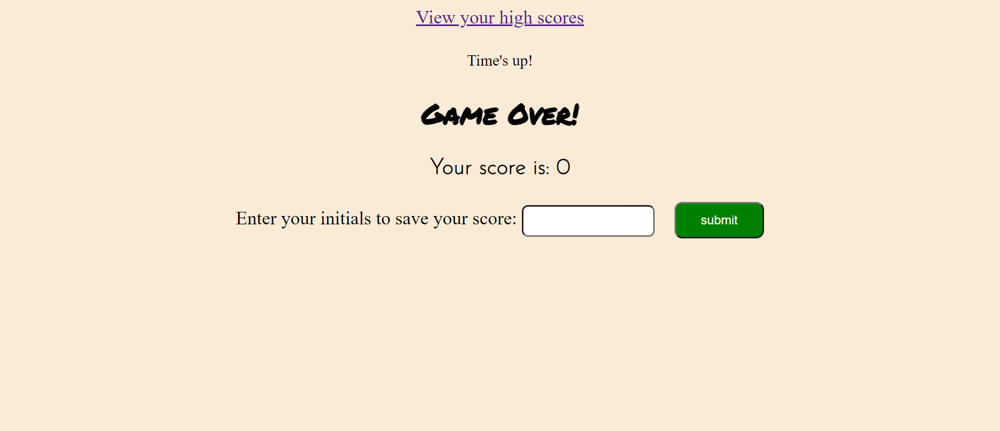

# coding-quiz
For this project I needed to create a coding quiz which used Javascript to satisfy certain criteria.

When the user clicks to begin te quiz a timer begins and they are presented with their first question.
When the first question is answered, they are then presented with the next question and so on.
As explained in the landing page of the quiz, for each incorrect answer there is a time penalty which
can be observed from the timer as questions are answered incorrectly. 
The quiz can either end by the user answering all questions and receiving a score or by the timer running out.
The user can then enter their initials to save their scores which will remain there until the user decides
to clear the scores.

the screenshots below show the general functionality of the quiz:

Below these images you can find a link to the deployed application

This is the landing page:

This is a screenshot from the middle of the quiz:

This image shows the final page of the quiz which asks for the user initials in order to save their score:

This image shows an example of previously saved high scores:

Application link: